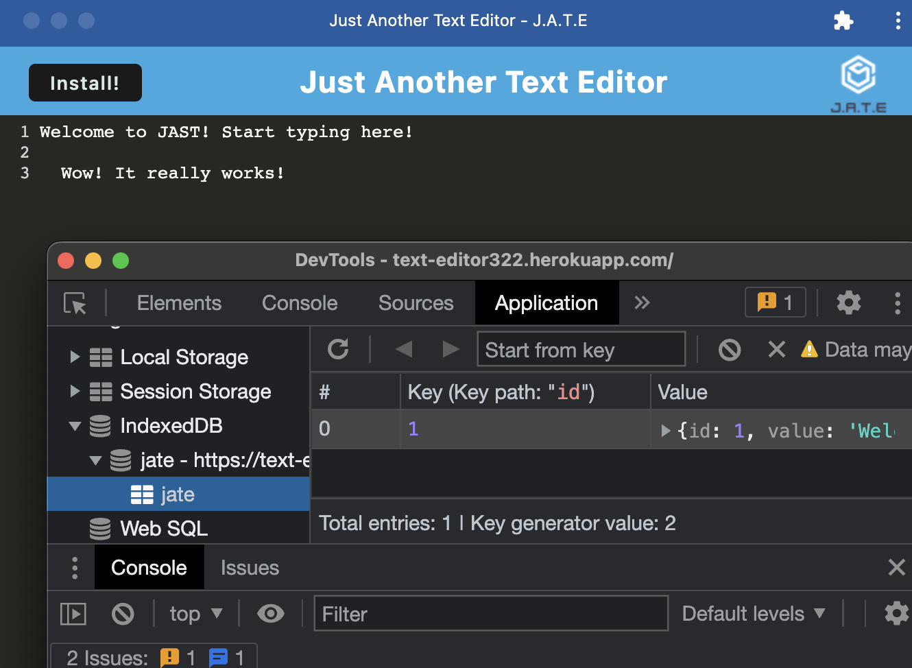

# JAST 

## Table of Contents

### [Description](#Description)

### [Installation](#Installation)

### [Usage](#Usage)

### [Testing](#Testing)

### [Contributors](#Contributors)

### [License](#License)

### [Questions](#Questions)

## Description

JAST is just another text editor. But this one is a fully stacked PWA with a service worker and amazing caches

## Installation

The program can be installed by clicking the 'install' icon at https://text-editor322.herokuapp.com/

## Usage

Simply type your text into the text editor. Click anywhere outside of the DOM to save. When you return, your data will persist!

## Testing

A full testing suite can be written with jest, please make a PR if you write any. For practical purposes, navigate to the webpage (https://text-editor322.herokuapp.com/), type in some text and refresh the page. You can also unplug your router and observe the application still functioning.

## Contributors

There was starter code for this application, as well as lots of coursework to reference dealing with similar concepts

## License

JAST is just another text editor. But this one is a fully stacked PWA with a service worker and amazing caches

## Questions

Philip Scott Neumann

https://github.com/moviefan322

philman202@yahoo.com
